# Tennis Academy Management Platform: Workflows Analysis & Data Mapping Guide

This guide provides a step-by-step technical analysis and data mapping breakdown for all **14 active automation workflows** configured in the Tennis Academy Management Platform (`./workflows`). 

Each workflow is executed on the **Pucho Studio Automation Engine** and interacts with system data stores (Google Sheets, CSV datastores, WhatsApp messaging APIs, Email services, and webhook event stores).

---

## Table of Workflows

| # | Workflow File | Workflow Name | Trigger Type | Step Count | Status |
|---|---|---|---|---|---|
| 1 | `UC-4_renewal_reminder_engine.json` | **UC-4 Renewal & Reminder Engine** | `tool-schedule` | 4 | 🟢 Active |
| 2 | `WF-D_student_onboarding.json` | **WF-D Student Onboarding** | `tool-webhook` | 6 | 🟢 Active |
| 3 | `WF-E_course_completion.json` | **WF-E Course Completion & Certification** | `tool-webhook` | 3 | 🟢 Active |
| 4 | `WF-F_daily_1on1_confirmation.json` | **WF-F Daily 1-on-1 Confirmation** | `tool-schedule` | 5 | 🟢 Active |
| 5 | `WF-G_package_validity.json` | **WF-G Package Validity & Expiry Engine** | `tool-schedule` | 4 | 🟢 Active |
| 6 | `WF-I_direct_payment_capture.json` | **WF-I Direct Payment Capture** | `tool-webhook` | 3 | 🟢 Active |
| 7 | `WF-J_club_excel_reconciliation.json` | **WF-J Club Excel Reconciliation** | `tool-webhook` | 6 | 🟢 Active |
| 8 | `WF-K_invoice_occupancy_report.json` | **WF-K Invoice & Occupancy Report** | `tool-webhook` | 8 | 🟢 Active |
| 9 | `WF-L_coach_payroll_leave.json` | **WF-L Coach Payroll & Leave Rollup** | `tool-webhook` | 10 | 🟢 Active |
| 10 | `WF-M Absence Alert Engine.json` | **WF-M Absence Alert Engine** | `tool-webhook` | 12 | 🟢 Active |
| 11 | `WF-M_absence_alert.json` | **WF-M Absence Alert Engine** | `tool-webhook` | 13 | 🟢 Active |
| 12 | `WF-O_payment_reminder_email.json` | **WF-O Payment Reminder Email** | `tool-webhook` | 12 | 🟢 Active |
| 13 | `WF-P_slot_report_email.json` | **WF-P Slot Report Email** | `tool-webhook` | 3 | 🟢 Active |
| 14 | `WF-webhook-store.json` | **WF-Webhook-Store Data Persistence** | `tool-webhook` | 3 | 🟢 Active |

---

## 1. UC-4 Renewal & Reminder Engine

- **File**: [`UC-4_renewal_reminder_engine.json`](file:///d:/Ravi/Ravi/Tennis%20Academy%20Platform/workflows/UC-4_renewal_reminder_engine.json)
- **Description**: Merged WF-G + WF-H: Daily 6AM cron checks active/expired packages, sends renewal reminders at D-6, overdue nudges at D+7/14/21/28. Gmail only, idempotent per subscription per day. Lapse at 45+ days handled by separate validity workflow.
- **Total Execution Steps**: 4

### 1. Workflow Architecture & Flow Diagram

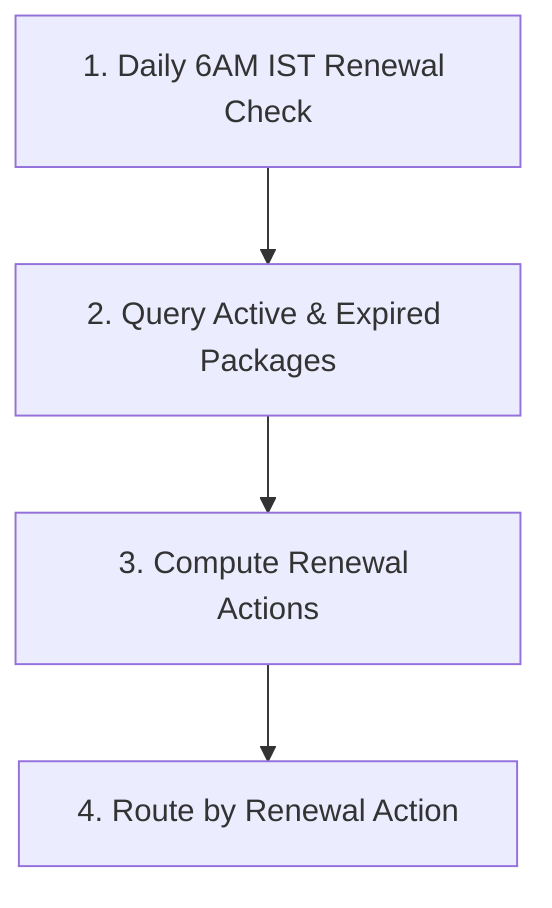

### 2. Step-by-Step Data Mapping & Node Configurations

#### Step 1: `Daily 6AM IST Renewal Check`
- **Internal Name / ID**: `trigger`
- **Step Category / Type**: `TOOL_TRIGGER`
- **Integration Piece**: `@puchoaistudio/tool-schedule` (Action: `every_day`)
- **Input Parameters & Configuration**:
```json
{
  "timezone": "Asia/Kolkata",
  "hour_of_the_day": 6,
  "run_on_weekends": true
}
```

##### 📤 Output Data Payload Mapping:
Passes step output `{{trigger}}` down the pipeline for subsequent step consumption.

#### Step 2: `Query Active & Expired Packages`
- **Internal Name / ID**: `step_1`
- **Step Category / Type**: `PIECE`
- **Integration Piece**: `@puchoaistudio/tool-google-sheets` (Action: `get_all_rows`)
- **Input Parameters & Configuration**:
```json
{
  "auth": "",
  "spreadsheetId": "1OTn3vT8qIeZFHzMZWAJHE_9ouqLGMiIF_zVEZQHq6DA",
  "sheetId": 1260552768,
  "memKey": "row_number",
  "startRow": 1,
  "groupSize": 1,
  "includeTeamDrives": false
}
```

##### 📊 Data Source Configuration:
- **Google Spreadsheet ID**: `1OTn3vT8qIeZFHzMZWAJHE_9ouqLGMiIF_zVEZQHq6DA`
- **Sheet ID / Tab**: `1260552768`
- **Primary Key / LookUp Key**: `row_number`

##### 📤 Output Data Payload Mapping:
Passes step output `{{step_1}}` down the pipeline for subsequent step consumption.

#### Step 3: `Compute Renewal Actions`
- **Internal Name / ID**: `step_2`
- **Step Category / Type**: `CODE`
- **Input Parameters & Configuration**:
```json
{
  "packages": "{{step_1}}"
}
```

##### 📤 Output Data Payload Mapping:
Passes step output `{{step_2}}` down the pipeline for subsequent step consumption.

#### Step 4: `Route by Renewal Action`
- **Internal Name / ID**: `step_router`
- **Step Category / Type**: `ROUTER`

##### 📤 Output Data Payload Mapping:
Passes step output `{{step_router}}` down the pipeline for subsequent step consumption.

---

## 2. WF-D Student Onboarding

- **File**: [`WF-D_student_onboarding.json`](file:///d:/Ravi/Ravi/Tennis%20Academy%20Platform/workflows/WF-D_student_onboarding.json)
- **Description**: Creates student profile, parent, package, sends welcome email and admission email on enrollment. Includes batch capacity soft-warning check (allow + flag).
- **Total Execution Steps**: 6

### 1. Workflow Architecture & Flow Diagram

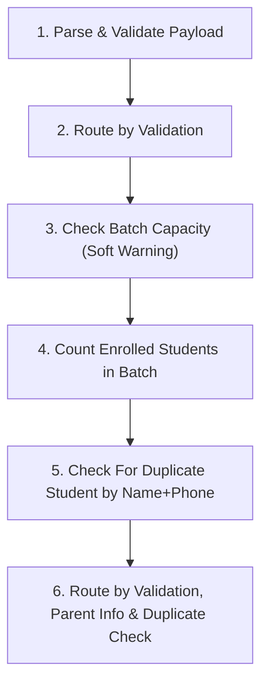

### 2. Step-by-Step Data Mapping & Node Configurations

#### Step 1: `Parse & Validate Payload`
- **Internal Name / ID**: `trigger`
- **Step Category / Type**: `TOOL_TRIGGER`
- **Integration Piece**: `@puchoaistudio/tool-webhook` (Action: `catch_webhook`)
- **Input Parameters & Configuration**:
```json
{
  "authType": "none",
  "authFields": {}
}
```

##### 📤 Output Data Payload Mapping:
Passes step output `{{trigger}}` down the pipeline for subsequent step consumption.

#### Step 2: `Route by Validation`
- **Internal Name / ID**: `step_1`
- **Step Category / Type**: `CODE`
- **Input Parameters & Configuration**:
```json
{
  "payload": "{{trigger['body']}}"
}
```

##### 📤 Output Data Payload Mapping:
Passes step output `{{step_1}}` down the pipeline for subsequent step consumption.

#### Step 3: `Check Batch Capacity (Soft Warning)`
- **Internal Name / ID**: `step_1a_cap`
- **Step Category / Type**: `PIECE`
- **Integration Piece**: `@puchoaistudio/tool-google-sheets` (Action: `find_rows`)
- **Input Parameters & Configuration**:
```json
{
  "auth": "",
  "spreadsheetId": "1OTn3vT8qIeZFHzMZWAJHE_9ouqLGMiIF_zVEZQHq6DA",
  "sheetId": 139096806,
  "columnName": "id",
  "searchValue": "{{step_1['batch_id']}}",
  "matchCase": false,
  "startingRow": 1,
  "numberOfRows": 1,
  "includeTeamDrives": false
}
```

##### 📊 Data Source Configuration:
- **Google Spreadsheet ID**: `1OTn3vT8qIeZFHzMZWAJHE_9ouqLGMiIF_zVEZQHq6DA`
- **Sheet ID / Tab**: `139096806`

##### 📤 Output Data Payload Mapping:
Passes step output `{{step_1a_cap}}` down the pipeline for subsequent step consumption.

#### Step 4: `Count Enrolled Students in Batch`
- **Internal Name / ID**: `step_1b_count`
- **Step Category / Type**: `PIECE`
- **Integration Piece**: `@puchoaistudio/tool-google-sheets` (Action: `find_rows`)
- **Input Parameters & Configuration**:
```json
{
  "auth": "",
  "spreadsheetId": "1OTn3vT8qIeZFHzMZWAJHE_9ouqLGMiIF_zVEZQHq6DA",
  "sheetId": 605693083,
  "columnName": "batch_id",
  "searchValue": "{{step_1['batch_id']}}",
  "matchCase": false,
  "startingRow": 1,
  "numberOfRows": 1,
  "includeTeamDrives": false
}
```

##### 📊 Data Source Configuration:
- **Google Spreadsheet ID**: `1OTn3vT8qIeZFHzMZWAJHE_9ouqLGMiIF_zVEZQHq6DA`
- **Sheet ID / Tab**: `605693083` (enrollments)

##### 📤 Output Data Payload Mapping:
Passes step output `{{step_1b_count}}` down the pipeline for subsequent step consumption.

#### Step 5: `Check For Duplicate Student by Name+Phone`
- **Internal Name / ID**: `step_1_dup`
- **Step Category / Type**: `PIECE`
- **Integration Piece**: `@puchoaistudio/tool-google-sheets` (Action: `find_rows`)
- **Input Parameters & Configuration**:
```json
{
  "auth": "",
  "spreadsheetId": "1OTn3vT8qIeZFHzMZWAJHE_9ouqLGMiIF_zVEZQHq6DA",
  "sheetId": 74175770,
  "columnName": "name",
  "searchValue": "{{step_1[\"dup_check_name\"]}}",
  "matchCase": false,
  "startingRow": 1,
  "numberOfRows": 1,
  "includeTeamDrives": false
}
```

##### 📊 Data Source Configuration:
- **Google Spreadsheet ID**: `1OTn3vT8qIeZFHzMZWAJHE_9ouqLGMiIF_zVEZQHq6DA`
- **Sheet ID / Tab**: `605693083` (enrollments)

##### 📤 Output Data Payload Mapping:
Passes step output `{{step_1_dup}}` down the pipeline for subsequent step consumption.

#### Step 6: `Route by Validation, Parent Info & Duplicate Check`
- **Internal Name / ID**: `step_router`
- **Step Category / Type**: `ROUTER`

##### 📤 Output Data Payload Mapping:
Passes step output `{{step_router}}` down the pipeline for subsequent step consumption.

---

## 3. WF-E Course Completion & Certification

- **File**: [`WF-E_course_completion.json`](file:///d:/Ravi/Ravi/Tennis%20Academy%20Platform/workflows/WF-E_course_completion.json)
- **Description**: Marks student as completed, updates package, sends certificate email on webhook trigger. Looks up parent email for notification.
- **Total Execution Steps**: 3

### 1. Workflow Architecture & Flow Diagram

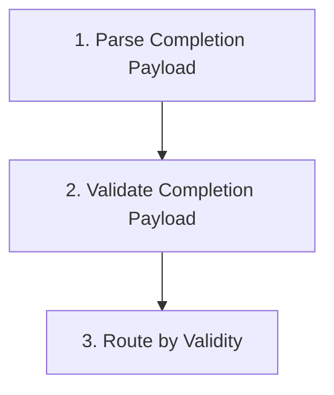

### 2. Step-by-Step Data Mapping & Node Configurations

#### Step 1: `Parse Completion Payload`
- **Internal Name / ID**: `trigger`
- **Step Category / Type**: `TOOL_TRIGGER`
- **Integration Piece**: `@puchoaistudio/tool-webhook` (Action: `catch_webhook`)
- **Input Parameters & Configuration**:
```json
{
  "authType": "none",
  "authFields": {}
}
```

##### 📤 Output Data Payload Mapping:
Passes step output `{{trigger}}` down the pipeline for subsequent step consumption.

#### Step 2: `Validate Completion Payload`
- **Internal Name / ID**: `step_1`
- **Step Category / Type**: `CODE`
- **Input Parameters & Configuration**:
```json
{
  "payload": "{{trigger['body']}}"
}
```

##### 📤 Output Data Payload Mapping:
Passes step output `{{step_1}}` down the pipeline for subsequent step consumption.

#### Step 3: `Route by Validity`
- **Internal Name / ID**: `step_router`
- **Step Category / Type**: `ROUTER`

##### 📤 Output Data Payload Mapping:
Passes step output `{{step_router}}` down the pipeline for subsequent step consumption.

---

## 4. WF-F Daily 1-on-1 Confirmation

- **File**: [`WF-F_daily_1on1_confirmation.json`](file:///d:/Ravi/Ravi/Tennis%20Academy%20Platform/workflows/WF-F_daily_1on1_confirmation.json)
- **Description**: Sends email confirmation every morning for today's 1-on-1 sessions. Queries schedule table, resolves parent via student_parents junction, sends Gmail with Confirm/Cancel links. Auto-declines sessions within T-2h cutoff (no time for response). Email only (no WhatsApp/SMS).
- **Total Execution Steps**: 5

### 1. Workflow Architecture & Flow Diagram

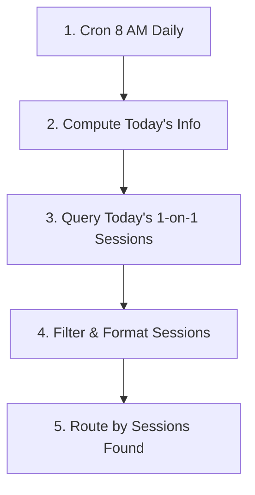

### 2. Step-by-Step Data Mapping & Node Configurations

#### Step 1: `Cron 8 AM Daily`
- **Internal Name / ID**: `trigger`
- **Step Category / Type**: `TOOL_TRIGGER`
- **Integration Piece**: `@puchoaistudio/tool-schedule` (Action: `every_day`)
- **Input Parameters & Configuration**:
```json
{
  "timezone": "Asia/Kolkata",
  "hour_of_the_day": 8,
  "run_on_weekends": false
}
```

##### 📤 Output Data Payload Mapping:
Passes step output `{{trigger}}` down the pipeline for subsequent step consumption.

#### Step 2: `Compute Today's Info`
- **Internal Name / ID**: `step_1`
- **Step Category / Type**: `CODE`

##### 📤 Output Data Payload Mapping:
Passes step output `{{step_1}}` down the pipeline for subsequent step consumption.

#### Step 3: `Query Today's 1-on-1 Sessions`
- **Internal Name / ID**: `step_2`
- **Step Category / Type**: `PIECE`
- **Integration Piece**: `@puchoaistudio/tool-google-sheets` (Action: `find_rows`)
- **Input Parameters & Configuration**:
```json
{
  "auth": "",
  "spreadsheetId": "1OTn3vT8qIeZFHzMZWAJHE_9ouqLGMiIF_zVEZQHq6DA",
  "sheetId": 721558255,
  "columnName": "type",
  "searchValue": "one_on_one",
  "matchCase": false,
  "startingRow": 1,
  "numberOfRows": 30,
  "includeTeamDrives": false
}
```

##### 📊 Data Source Configuration:
- **Google Spreadsheet ID**: `1OTn3vT8qIeZFHzMZWAJHE_9ouqLGMiIF_zVEZQHq6DA`
- **Sheet ID / Tab**: `721558255`

##### 📤 Output Data Payload Mapping:
Passes step output `{{step_2}}` down the pipeline for subsequent step consumption.

#### Step 4: `Filter & Format Sessions`
- **Internal Name / ID**: `step_3`
- **Step Category / Type**: `CODE`
- **Input Parameters & Configuration**:
```json
{
  "sessions": "{{step_2}}",
  "day": "{{step_1['day']}}",
  "date": "{{step_1['date']}}"
}
```

##### 📤 Output Data Payload Mapping:
Passes step output `{{step_3}}` down the pipeline for subsequent step consumption.

#### Step 5: `Route by Sessions Found`
- **Internal Name / ID**: `step_router`
- **Step Category / Type**: `ROUTER`

##### 📤 Output Data Payload Mapping:
Passes step output `{{step_router}}` down the pipeline for subsequent step consumption.

---

## 5. WF-G Package Validity & Expiry Engine

- **File**: [`WF-G_package_validity.json`](file:///d:/Ravi/Ravi/Tennis%20Academy%20Platform/workflows/WF-G_package_validity.json)
- **Description**: Daily check of active packages: warns at day 35 (d_minus_10), expires at day 45 (expiry_day). Tracks three dimensions of unutilized: days-to-expiry, remaining sessions, and dormancy (20+ days with zero sessions consumed). Resolves parent via student_parents junction, updates DB, sends email, logs reminders. Processes ALL matching packages in a single run.
- **Total Execution Steps**: 4

### 1. Workflow Architecture & Flow Diagram

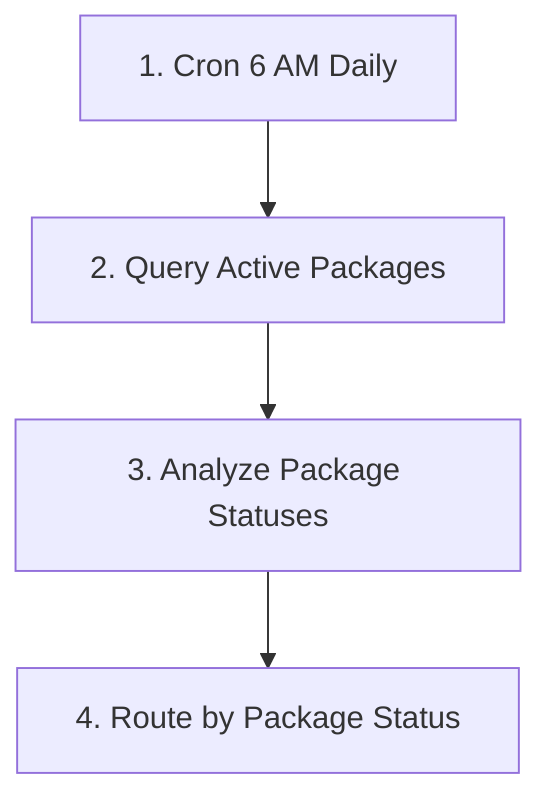

### 2. Step-by-Step Data Mapping & Node Configurations

#### Step 1: `Cron 6 AM Daily`
- **Internal Name / ID**: `trigger`
- **Step Category / Type**: `TOOL_TRIGGER`
- **Integration Piece**: `@puchoaistudio/tool-schedule` (Action: `every_day`)
- **Input Parameters & Configuration**:
```json
{
  "timezone": "Asia/Kolkata",
  "hour_of_the_day": 6,
  "run_on_weekends": true
}
```

##### 📤 Output Data Payload Mapping:
Passes step output `{{trigger}}` down the pipeline for subsequent step consumption.

#### Step 2: `Query Active Packages`
- **Internal Name / ID**: `step_1`
- **Step Category / Type**: `PIECE`
- **Integration Piece**: `@puchoaistudio/tool-google-sheets` (Action: `find_rows`)
- **Input Parameters & Configuration**:
```json
{
  "auth": "",
  "spreadsheetId": "1OTn3vT8qIeZFHzMZWAJHE_9ouqLGMiIF_zVEZQHq6DA",
  "sheetId": 1260552768,
  "columnName": "status",
  "searchValue": "active",
  "matchCase": false,
  "startingRow": 1,
  "numberOfRows": 50,
  "includeTeamDrives": false
}
```

##### 📊 Data Source Configuration:
- **Google Spreadsheet ID**: `1OTn3vT8qIeZFHzMZWAJHE_9ouqLGMiIF_zVEZQHq6DA`
- **Sheet ID / Tab**: `1260552768`

##### 📤 Output Data Payload Mapping:
Passes step output `{{step_1}}` down the pipeline for subsequent step consumption.

#### Step 3: `Analyze Package Statuses`
- **Internal Name / ID**: `step_2`
- **Step Category / Type**: `CODE`
- **Input Parameters & Configuration**:
```json
{
  "packages": "{{step_1}}"
}
```

##### 📤 Output Data Payload Mapping:
Passes step output `{{step_2}}` down the pipeline for subsequent step consumption.

#### Step 4: `Route by Package Status`
- **Internal Name / ID**: `step_router`
- **Step Category / Type**: `ROUTER`

##### 📤 Output Data Payload Mapping:
Passes step output `{{step_router}}` down the pipeline for subsequent step consumption.

---

## 6. WF-H Renewal Drip Campaign [DEPRECATED]

- **File**: [`WF-H_renewal_drip.json`](file:///d:/Ravi/Ravi/Tennis%20Academy%20Platform/workflows/WF-H_renewal_drip.json)
- **Description**: DEPRECATED — Superseded by UC-4 Renewal & Reminder Engine. This workflow used start_date instead of expiry_date, had unfiltered queries, and used phone as email receiver. Do not activate.
- **Total Execution Steps**: 4

### 1. Workflow Architecture & Flow Diagram

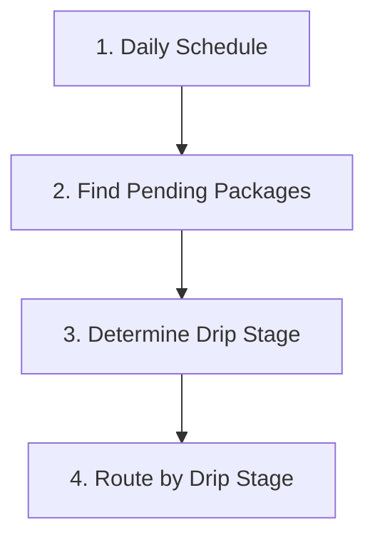

### 2. Step-by-Step Data Mapping & Node Configurations

#### Step 1: `Daily Schedule`
- **Internal Name / ID**: `trigger`
- **Step Category / Type**: `TOOL_TRIGGER`
- **Integration Piece**: `@puchoaistudio/tool-schedule` (Action: `every_day`)
- **Input Parameters & Configuration**:
```json
{
  "timezone": "Asia/Kolkata",
  "hour_of_the_day": 10,
  "run_on_weekends": true
}
```

##### 📤 Output Data Payload Mapping:
Passes step output `{{trigger}}` down the pipeline for subsequent step consumption.

#### Step 2: `Find Pending Packages`
- **Internal Name / ID**: `step_1`
- **Step Category / Type**: `PIECE`
- **Integration Piece**: `@puchoaistudio/tool-google-sheets` (Action: `get_all_rows`)
- **Input Parameters & Configuration**:
```json
{
  "auth": "",
  "spreadsheetId": "1OTn3vT8qIeZFHzMZWAJHE_9ouqLGMiIF_zVEZQHq6DA",
  "sheetId": 1260552768,
  "memKey": "row_number",
  "startRow": 1,
  "groupSize": 1,
  "includeTeamDrives": false
}
```

##### 📊 Data Source Configuration:
- **Google Spreadsheet ID**: `1OTn3vT8qIeZFHzMZWAJHE_9ouqLGMiIF_zVEZQHq6DA`
- **Sheet ID / Tab**: `1260552768`
- **Primary Key / LookUp Key**: `row_number`

##### 📤 Output Data Payload Mapping:
Passes step output `{{step_1}}` down the pipeline for subsequent step consumption.

#### Step 3: `Determine Drip Stage`
- **Internal Name / ID**: `step_2`
- **Step Category / Type**: `CODE`
- **Input Parameters & Configuration**:
```json
{
  "packages": "{{step_1}}"
}
```

##### 📤 Output Data Payload Mapping:
Passes step output `{{step_2}}` down the pipeline for subsequent step consumption.

#### Step 4: `Route by Drip Stage`
- **Internal Name / ID**: `step_router`
- **Step Category / Type**: `ROUTER`

##### 📤 Output Data Payload Mapping:
Passes step output `{{step_router}}` down the pipeline for subsequent step consumption.

---

## 7. WF-I Direct Payment Capture

- **File**: [`WF-I_direct_payment_capture.json`](file:///d:/Ravi/Ravi/Tennis%20Academy%20Platform/workflows/WF-I_direct_payment_capture.json)
- **Description**: Captures Stripe payment_intent.succeeded webhook, creates payment record, updates package status, resets reminder workflows
- **Total Execution Steps**: 3

### 1. Workflow Architecture & Flow Diagram

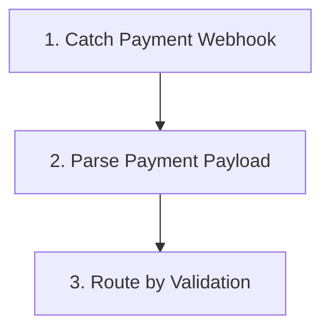

### 2. Step-by-Step Data Mapping & Node Configurations

#### Step 1: `Catch Payment Webhook`
- **Internal Name / ID**: `trigger`
- **Step Category / Type**: `TOOL_TRIGGER`
- **Integration Piece**: `@puchoaistudio/tool-webhook` (Action: `catch_webhook`)
- **Input Parameters & Configuration**:
```json
{
  "authType": "none",
  "authFields": {}
}
```

##### 📤 Output Data Payload Mapping:
Passes step output `{{trigger}}` down the pipeline for subsequent step consumption.

#### Step 2: `Parse Payment Payload`
- **Internal Name / ID**: `step_1`
- **Step Category / Type**: `CODE`
- **Input Parameters & Configuration**:
```json
{
  "payload": "{{trigger['body']}}"
}
```

##### 📤 Output Data Payload Mapping:
Passes step output `{{step_1}}` down the pipeline for subsequent step consumption.

#### Step 3: `Route by Validation`
- **Internal Name / ID**: `step_router`
- **Step Category / Type**: `ROUTER`

##### 📤 Output Data Payload Mapping:
Passes step output `{{step_router}}` down the pipeline for subsequent step consumption.

---

## 8. WF-J Club Excel Reconciliation

- **File**: [`WF-J_club_excel_reconciliation.json`](file:///d:/Ravi/Ravi/Tennis%20Academy%20Platform/workflows/WF-J_club_excel_reconciliation.json)
- **Description**: PENDING CLIENT DECISION (MoM Aug 2026): Club payments are processed directly by the club, not the academy. Current Excel-reconciliation logic is a WORKING ASSUMPTION only. Do not finalize WF-J until client answers: 'How will the system handle payment tracking and billing for The Club?'. This workflow receives pre-parsed excel rows via webhook, matches against system students, creates reconciliation entries, and returns summary.
- **Total Execution Steps**: 6

### 1. Workflow Architecture & Flow Diagram

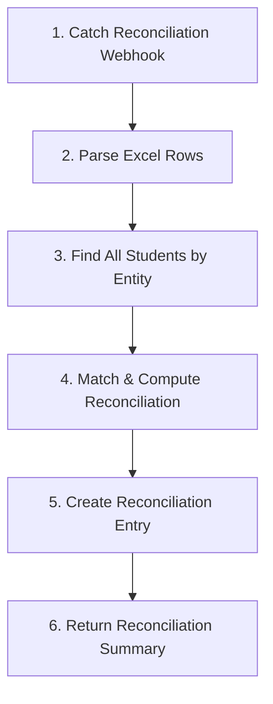

### 2. Step-by-Step Data Mapping & Node Configurations

#### Step 1: `Catch Reconciliation Webhook`
- **Internal Name / ID**: `trigger`
- **Step Category / Type**: `TOOL_TRIGGER`
- **Integration Piece**: `@puchoaistudio/tool-webhook` (Action: `catch_webhook`)
- **Input Parameters & Configuration**:
```json
{
  "authType": "none",
  "authFields": {}
}
```

##### 📤 Output Data Payload Mapping:
Passes step output `{{trigger}}` down the pipeline for subsequent step consumption.

#### Step 2: `Parse Excel Rows`
- **Internal Name / ID**: `step_1`
- **Step Category / Type**: `CODE`
- **Input Parameters & Configuration**:
```json
{
  "payload": "{{trigger['body']}}"
}
```

##### 📤 Output Data Payload Mapping:
Passes step output `{{step_1}}` down the pipeline for subsequent step consumption.

#### Step 3: `Find All Students by Entity`
- **Internal Name / ID**: `step_2`
- **Step Category / Type**: `PIECE`
- **Integration Piece**: `@puchoaistudio/tool-google-sheets` (Action: `get_all_rows`)
- **Input Parameters & Configuration**:
```json
{
  "auth": "",
  "spreadsheetId": "1OTn3vT8qIeZFHzMZWAJHE_9ouqLGMiIF_zVEZQHq6DA",
  "sheetId": 74175770,
  "memKey": "row_number",
  "startRow": 1,
  "groupSize": 1,
  "includeTeamDrives": false
}
```

##### 📊 Data Source Configuration:
- **Google Spreadsheet ID**: `1OTn3vT8qIeZFHzMZWAJHE_9ouqLGMiIF_zVEZQHq6DA`
- **Sheet ID / Tab**: `605693083` (enrollments)
- **Primary Key / LookUp Key**: `row_number`

##### 📤 Output Data Payload Mapping:
Passes step output `{{step_2}}` down the pipeline for subsequent step consumption.

#### Step 4: `Match & Compute Reconciliation`
- **Internal Name / ID**: `step_3`
- **Step Category / Type**: `CODE`
- **Input Parameters & Configuration**:
```json
{
  "excel_rows": "{{step_1['rows']}}",
  "students": "{{step_2['data']}}",
  "entity": "{{step_1['entity']}}"
}
```

##### 📤 Output Data Payload Mapping:
Passes step output `{{step_3}}` down the pipeline for subsequent step consumption.

#### Step 5: `Create Reconciliation Entry`
- **Internal Name / ID**: `step_4`
- **Step Category / Type**: `PIECE`
- **Integration Piece**: `@puchoaistudio/tool-google-sheets` (Action: `insert_row`)
- **Input Parameters & Configuration**:
```json
{
  "auth": "",
  "spreadsheetId": "1OTn3vT8qIeZFHzMZWAJHE_9ouqLGMiIF_zVEZQHq6DA",
  "sheetId": 0,
  "values": {
    "student_id": "{{step_3['entries'][0]['student_id']}}",
    "entity": "{{step_3['entries'][0]['entity']}}",
    "excel_amount": "{{step_3['entries'][0]['excel_amount']}}",
    "system_amount": "{{step_3['entries'][0]['system_amount']}}",
    "gateway": "{{step_3['entries'][0]['gateway']}}",
    "status": "{{step_3['entries'][0]['status']}}",
    "date": "{{step_3['entries'][0]['date']}}",
    "note": "{{step_3['entries'][0]['note']}}"
  },
  "as_string": false,
  "first_row_headers": true,
  "includeTeamDrives": false
}
```

##### 📊 Data Source Configuration:
- **Google Spreadsheet ID**: `1OTn3vT8qIeZFHzMZWAJHE_9ouqLGMiIF_zVEZQHq6DA`

##### 📤 Output Data Payload Mapping:
Passes step output `{{step_4}}` down the pipeline for subsequent step consumption.

#### Step 6: `Return Reconciliation Summary`
- **Internal Name / ID**: `step_5`
- **Step Category / Type**: `PIECE`
- **Integration Piece**: `@puchoaistudio/tool-webhook` (Action: `return_response`)
- **Input Parameters & Configuration**:
```json
{
  "fields": {
    "body": {
      "success": true,
      "entity": "{{step_1['entity']}}",
      "total_rows": "{{step_3['total_rows']}}",
      "matched_count": "{{step_3['matched_count']}}",
      "mismatch_count": "{{step_3['mismatch_count']}}",
      "new_count": "{{step_3['new_count']}}",
      "message": "Reconciliation entries created successfully"
    },
    "status": 200,
    "headers": {}
  },
  "respond": "stop",
  "responseType": "json"
}
```

##### 📤 Output Data Payload Mapping:
Passes step output `{{step_5}}` down the pipeline for subsequent step consumption.

---

## 9. WF-K Invoice & Occupancy Report

- **File**: [`WF-K_invoice_occupancy_report.json`](file:///d:/Ravi/Ravi/Tennis%20Academy%20Platform/workflows/WF-K_invoice_occupancy_report.json)
- **Description**: Generates monthly invoice and occupancy report: aggregates payments and attendance, computes revenue and occupancy %, emails report to admin
- **Total Execution Steps**: 8

### 1. Workflow Architecture & Flow Diagram

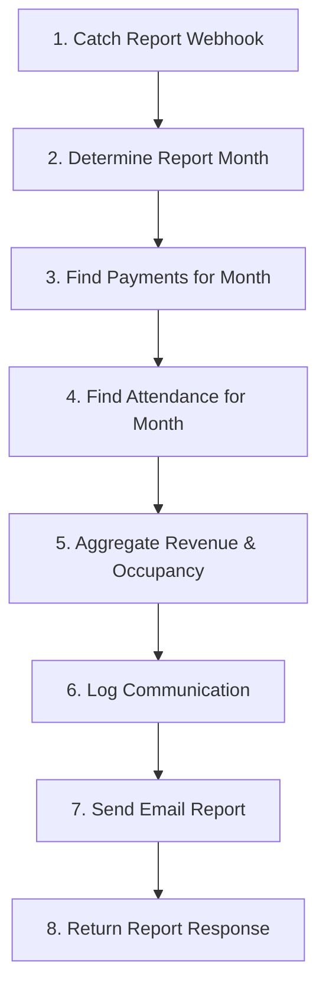

### 2. Step-by-Step Data Mapping & Node Configurations

#### Step 1: `Catch Report Webhook`
- **Internal Name / ID**: `trigger`
- **Step Category / Type**: `TOOL_TRIGGER`
- **Integration Piece**: `@puchoaistudio/tool-webhook` (Action: `catch_webhook`)
- **Input Parameters & Configuration**:
```json
{
  "authType": "none",
  "authFields": {}
}
```

##### 📤 Output Data Payload Mapping:
Passes step output `{{trigger}}` down the pipeline for subsequent step consumption.

#### Step 2: `Determine Report Month`
- **Internal Name / ID**: `step_1`
- **Step Category / Type**: `CODE`
- **Input Parameters & Configuration**:
```json
{
  "payload": "{{trigger['body']}}"
}
```

##### 📤 Output Data Payload Mapping:
Passes step output `{{step_1}}` down the pipeline for subsequent step consumption.

#### Step 3: `Find Payments for Month`
- **Internal Name / ID**: `step_2`
- **Step Category / Type**: `PIECE`
- **Integration Piece**: `@puchoaistudio/tool-google-sheets` (Action: `get_all_rows`)
- **Input Parameters & Configuration**:
```json
{
  "auth": "",
  "spreadsheetId": "1OTn3vT8qIeZFHzMZWAJHE_9ouqLGMiIF_zVEZQHq6DA",
  "sheetId": 800907974,
  "memKey": "row_number",
  "startRow": 1,
  "groupSize": 1,
  "includeTeamDrives": false
}
```

##### 📊 Data Source Configuration:
- **Google Spreadsheet ID**: `1OTn3vT8qIeZFHzMZWAJHE_9ouqLGMiIF_zVEZQHq6DA`
- **Sheet ID / Tab**: `800907974`
- **Primary Key / LookUp Key**: `row_number`

##### 📤 Output Data Payload Mapping:
Passes step output `{{step_2}}` down the pipeline for subsequent step consumption.

#### Step 4: `Find Attendance for Month`
- **Internal Name / ID**: `step_3`
- **Step Category / Type**: `PIECE`
- **Integration Piece**: `@puchoaistudio/tool-google-sheets` (Action: `get_all_rows`)
- **Input Parameters & Configuration**:
```json
{
  "auth": "",
  "spreadsheetId": "1OTn3vT8qIeZFHzMZWAJHE_9ouqLGMiIF_zVEZQHq6DA",
  "sheetId": 772014212,
  "memKey": "row_number",
  "startRow": 1,
  "groupSize": 1,
  "includeTeamDrives": false
}
```

##### 📊 Data Source Configuration:
- **Google Spreadsheet ID**: `1OTn3vT8qIeZFHzMZWAJHE_9ouqLGMiIF_zVEZQHq6DA`
- **Sheet ID / Tab**: `772014212`
- **Primary Key / LookUp Key**: `row_number`

##### 📤 Output Data Payload Mapping:
Passes step output `{{step_3}}` down the pipeline for subsequent step consumption.

#### Step 5: `Aggregate Revenue & Occupancy`
- **Internal Name / ID**: `step_4`
- **Step Category / Type**: `CODE`
- **Input Parameters & Configuration**:
```json
{
  "payments": "{{step_2['data']}}",
  "attendance": "{{step_3['data']}}",
  "month_name": "{{step_1['month_name']}}",
  "year": "{{step_1['year']}}"
}
```

##### 📤 Output Data Payload Mapping:
Passes step output `{{step_4}}` down the pipeline for subsequent step consumption.

#### Step 6: `Log Communication`
- **Internal Name / ID**: `step_5`
- **Step Category / Type**: `PIECE`
- **Integration Piece**: `@puchoaistudio/tool-google-sheets` (Action: `insert_row`)
- **Input Parameters & Configuration**:
```json
{
  "auth": "",
  "spreadsheetId": "1OTn3vT8qIeZFHzMZWAJHE_9ouqLGMiIF_zVEZQHq6DA",
  "sheetId": 0,
  "values": {
    "student_id": "",
    "type": "invoice",
    "channel": "email",
    "status": "sent",
    "date": "{{step_1['start_date']}}",
    "file_link": ""
  },
  "as_string": false,
  "first_row_headers": true,
  "includeTeamDrives": false
}
```

##### 📊 Data Source Configuration:
- **Google Spreadsheet ID**: `1OTn3vT8qIeZFHzMZWAJHE_9ouqLGMiIF_zVEZQHq6DA`

##### 📤 Output Data Payload Mapping:
Passes step output `{{step_5}}` down the pipeline for subsequent step consumption.

#### Step 7: `Send Email Report`
- **Internal Name / ID**: `step_6`
- **Step Category / Type**: `PIECE`
- **Integration Piece**: `@puchoaistudio/tool-gmail` (Action: `send_email`)
- **Input Parameters & Configuration**:
```json
{
  "auth": "",
  "receiver": [
    "admin@arnavtennis.com"
  ],
  "subject": "Monthly Invoice & Occupancy Report - {{step_4['month_name']}} {{step_4['year']}}",
  "body": "Monthly Report for {{step_4['month_name']}} {{step_4['year']}}\n\nTotal Revenue: Rs.{{step_4['total_revenue']}}\nGroup Revenue: Rs.{{step_4['group_revenue']}}\n1-on-1 Revenue: Rs.{{step_4['one_on_one_revenue']}}\n\nTotal Sessions: {{step_4['total_sessions']}}\nTotal Attendance: {{step_4['total_attendance']}}\nOverall Occupancy: {{step_4['overall_occupancy']}}%\nGroup Occupancy: {{step_4['group_occupancy']}}%\n1-on-1 Occupancy: {{step_4['one_on_one_occupancy']}}%\n\nPayments Processed: {{step_4['payment_count']}}\n\nGenerated by Arnav Jain Tennis Academy",
  "body_type": "text",
  "cc": [],
  "bcc": [],
  "reply_to": [],
  "draft": false
}
```

##### 💬 Message & Notification Template:
- **Recipient**: `admin@arnavtennis.com`
- **Subject**: `Monthly Invoice & Occupancy Report - {{step_4['month_name']}} {{step_4['year']}}`
- **Content / Body**:
```text
Monthly Report for {{step_4['month_name']}} {{step_4['year']}}

Total Revenue: Rs.{{step_4['total_revenue']}}
Group Revenue: Rs.{{step_4['group_revenue']}}
1-on-1 Revenue: Rs.{{step_4['one_on_one_revenue']}}

Total Sessions: {{step_4['total_sessions']}}
Total Attendance: {{step_4['total_attendance']}}
Overall Occupancy: {{step_4['overall_occupancy']}}%
Group Occupancy: {{step_4['group_occupancy']}}%
1-on-1 Occupancy: {{step_4['one_on_one_occupancy']}}%

Payments Processed: {{step_4['payment_count']}}

Generated by Arnav Jain Tennis Academy
```

##### 📤 Output Data Payload Mapping:
Passes step output `{{step_6}}` down the pipeline for subsequent step consumption.

#### Step 8: `Return Report Response`
- **Internal Name / ID**: `step_7`
- **Step Category / Type**: `PIECE`
- **Integration Piece**: `@puchoaistudio/tool-webhook` (Action: `return_response`)
- **Input Parameters & Configuration**:
```json
{
  "fields": {
    "body": {
      "success": true,
      "month": "{{step_4['month_name']}}",
      "year": "{{step_4['year']}}",
      "total_revenue": "{{step_4['total_revenue']}}",
      "group_occupancy": "{{step_4['group_occupancy']}}",
      "one_on_one_occupancy": "{{step_4['one_on_one_occupancy']}}",
      "overall_occupancy": "{{step_4['overall_occupancy']}}",
      "message": "Monthly report generated and emailed successfully"
    },
    "status": 200,
    "headers": {}
  },
  "respond": "stop",
  "responseType": "json"
}
```

##### 📤 Output Data Payload Mapping:
Passes step output `{{step_7}}` down the pipeline for subsequent step consumption.

---

## 10. WF-L Coach Payroll & Leave Rollup

- **File**: [`WF-L_coach_payroll_leave.json`](file:///d:/Ravi/Ravi/Tennis%20Academy%20Platform/workflows/WF-L_coach_payroll_leave.json)
- **Description**: Generates monthly coach payroll report with entity-specific paths: The Club (session-based, half_day/full_day, approval-gated) and TOTS Tennis (hourly billing, hours_logged x hourly_rate). Triggered via webhook with month/year params.
- **Total Execution Steps**: 10

### 1. Workflow Architecture & Flow Diagram

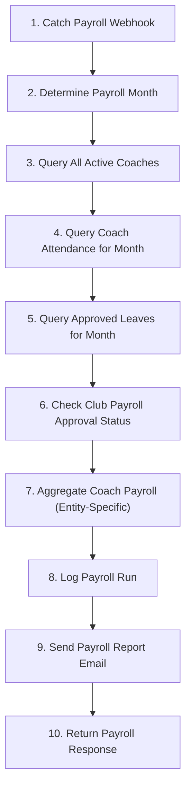

### 2. Step-by-Step Data Mapping & Node Configurations

#### Step 1: `Catch Payroll Webhook`
- **Internal Name / ID**: `trigger`
- **Step Category / Type**: `TOOL_TRIGGER`
- **Integration Piece**: `@puchoaistudio/tool-webhook` (Action: `catch_webhook`)
- **Input Parameters & Configuration**:
```json
{
  "authType": "none",
  "authFields": {}
}
```

##### 📤 Output Data Payload Mapping:
Passes step output `{{trigger}}` down the pipeline for subsequent step consumption.

#### Step 2: `Determine Payroll Month`
- **Internal Name / ID**: `step_1`
- **Step Category / Type**: `CODE`
- **Input Parameters & Configuration**:
```json
{
  "payload": "{{trigger['body']}}"
}
```

##### 📤 Output Data Payload Mapping:
Passes step output `{{step_1}}` down the pipeline for subsequent step consumption.

#### Step 3: `Query All Active Coaches`
- **Internal Name / ID**: `step_2`
- **Step Category / Type**: `PIECE`
- **Integration Piece**: `@puchoaistudio/tool-google-sheets` (Action: `find_rows`)
- **Input Parameters & Configuration**:
```json
{
  "auth": "",
  "spreadsheetId": "1OTn3vT8qIeZFHzMZWAJHE_9ouqLGMiIF_zVEZQHq6DA",
  "sheetId": 731582326,
  "columnName": "status",
  "searchValue": "inactive",
  "matchCase": false,
  "startingRow": 1,
  "numberOfRows": 50,
  "includeTeamDrives": false
}
```

##### 📊 Data Source Configuration:
- **Google Spreadsheet ID**: `1OTn3vT8qIeZFHzMZWAJHE_9ouqLGMiIF_zVEZQHq6DA`
- **Sheet ID / Tab**: `731582326`

##### 📤 Output Data Payload Mapping:
Passes step output `{{step_2}}` down the pipeline for subsequent step consumption.

#### Step 4: `Query Coach Attendance for Month`
- **Internal Name / ID**: `step_3`
- **Step Category / Type**: `PIECE`
- **Integration Piece**: `@puchoaistudio/tool-google-sheets` (Action: `find_rows`)
- **Input Parameters & Configuration**:
```json
{
  "auth": "",
  "spreadsheetId": "1OTn3vT8qIeZFHzMZWAJHE_9ouqLGMiIF_zVEZQHq6DA",
  "sheetId": 0,
  "columnName": "date",
  "searchValue": "{{step_1['start_date']}}",
  "matchCase": false,
  "startingRow": 1,
  "numberOfRows": 200,
  "includeTeamDrives": false
}
```

##### 📊 Data Source Configuration:
- **Google Spreadsheet ID**: `1OTn3vT8qIeZFHzMZWAJHE_9ouqLGMiIF_zVEZQHq6DA`

##### 📤 Output Data Payload Mapping:
Passes step output `{{step_3}}` down the pipeline for subsequent step consumption.

#### Step 5: `Query Approved Leaves for Month`
- **Internal Name / ID**: `step_4`
- **Step Category / Type**: `PIECE`
- **Integration Piece**: `@puchoaistudio/tool-google-sheets` (Action: `find_rows`)
- **Input Parameters & Configuration**:
```json
{
  "auth": "",
  "spreadsheetId": "1OTn3vT8qIeZFHzMZWAJHE_9ouqLGMiIF_zVEZQHq6DA",
  "sheetId": 0,
  "columnName": "status",
  "searchValue": "approved",
  "matchCase": false,
  "startingRow": 1,
  "numberOfRows": 100,
  "includeTeamDrives": false
}
```

##### 📊 Data Source Configuration:
- **Google Spreadsheet ID**: `1OTn3vT8qIeZFHzMZWAJHE_9ouqLGMiIF_zVEZQHq6DA`

##### 📤 Output Data Payload Mapping:
Passes step output `{{step_4}}` down the pipeline for subsequent step consumption.

#### Step 6: `Check Club Payroll Approval Status`
- **Internal Name / ID**: `step_5_check_approval`
- **Step Category / Type**: `CODE`
- **Input Parameters & Configuration**:
```json
{
  "coaches_json": "{{step_2}}",
  "attendance": "{{step_3}}",
  "month_name": "{{step_1['month_name']}}",
  "year": "{{step_1['year']}}"
}
```

##### 📤 Output Data Payload Mapping:
Passes step output `{{step_5_check_approval}}` down the pipeline for subsequent step consumption.

#### Step 7: `Aggregate Coach Payroll (Entity-Specific)`
- **Internal Name / ID**: `step_5_aggregate`
- **Step Category / Type**: `CODE`
- **Input Parameters & Configuration**:
```json
{
  "coaches_json": "{{step_2}}",
  "attendance": "{{step_3}}",
  "leaves": "{{step_4}}",
  "approval_check": "{{step_5_check_approval}}",
  "month_name": "{{step_1['month_name']}}",
  "year": "{{step_1['year']}}",
  "month": "{{step_1['month']}}"
}
```

##### 📤 Output Data Payload Mapping:
Passes step output `{{step_5_aggregate}}` down the pipeline for subsequent step consumption.

#### Step 8: `Log Payroll Run`
- **Internal Name / ID**: `step_6`
- **Step Category / Type**: `PIECE`
- **Integration Piece**: `@puchoaistudio/tool-google-sheets` (Action: `insert_row`)
- **Input Parameters & Configuration**:
```json
{
  "auth": "",
  "spreadsheetId": "1OTn3vT8qIeZFHzMZWAJHE_9ouqLGMiIF_zVEZQHq6DA",
  "sheetId": 0,
  "values": {
    "type": "payroll",
    "channel": "email",
    "status": "sent",
    "date": "{{step_1['start_date']}}"
  },
  "as_string": false,
  "first_row_headers": true,
  "includeTeamDrives": false
}
```

##### 📊 Data Source Configuration:
- **Google Spreadsheet ID**: `1OTn3vT8qIeZFHzMZWAJHE_9ouqLGMiIF_zVEZQHq6DA`

##### 📤 Output Data Payload Mapping:
Passes step output `{{step_6}}` down the pipeline for subsequent step consumption.

#### Step 9: `Send Payroll Report Email`
- **Internal Name / ID**: `step_7`
- **Step Category / Type**: `PIECE`
- **Integration Piece**: `@puchoaistudio/tool-gmail` (Action: `send_email`)
- **Input Parameters & Configuration**:
```json
{
  "auth": "",
  "receiver": [
    "admin@arnavtennis.com"
  ],
  "subject": "Coach Payroll Report - {{step_5_aggregate['month_name']}} {{step_5_aggregate['year']}} [PENDING APPROVAL]",
  "body": "Coach Payroll Report for {{step_5_aggregate['month_name']}} {{step_5_aggregate['year']}}\n\nTotal Coaches: {{step_5_aggregate['coach_count']}}\nWorking Days: {{step_5_aggregate['working_days']}}\nTotal Payroll: Rs.{{step_5_aggregate['total_payroll']}}\n\n\n## WARNING: PENDING APPROVALS ##\nSome Club coaches have attendance records awaiting head coach or admin approval.\nPayroll amounts for those coaches are provisional and will not be finalized\nuntil all attendance records are approved.\n\n\nBreakdown:\n\n\n--- {{coach.coach_name}} ({{coach.calculation_method}}) ---\n\n  Monthly Salary: Rs.{{coach.details.monthly_salary}}\n  Daily Rate: Rs.{{coach.details.daily_rate}} ({{coach.details.working_days}} working days)\n  Half-Day Sessions: {{coach.details.half_day_sessions}} | Full-Day Sessions: {{coach.details.full_day_sessions}}\n  Total Sessions: {{coach.details.total_sessions}}\n  Leave: {{coach.details.leave_days}} days | Deduction: Rs.{{coach.details.leave_deduction}}\n  Approval Status: {{coach.details.approval_status}}\n\n  NOTE: {{coach.details.approval_note}}\n\n\n  Hours Logged: {{coach.details.hours_logged}}\n  Hourly Rate: Rs.{{coach.details.hourly_rate}}\n\n  Net Payable: Rs.{{coach.payroll_amount}}\n\n\nCalculation Methods:\n- The Club coaches: Monthly Salary - (Leave Days x Daily Rate)\n  Session periods (half_day/full_day) tracked for payroll accuracy.\n  Requires admin/head coach approval before finalization.\n- TOTS Tennis coaches: Hours Logged x Hourly Rate\n\nThis report was auto-generated. Please verify before processing payouts.\n\nGenerated by Arnav Jain Tennis Academy",
  "body_type": "text",
  "cc": [],
  "bcc": [],
  "reply_to": [],
  "draft": false
}
```

##### 💬 Message & Notification Template:
- **Recipient**: `admin@arnavtennis.com`
- **Subject**: `Coach Payroll Report - {{step_5_aggregate['month_name']}} {{step_5_aggregate['year']}} [PENDING APPROVAL]`
- **Content / Body**:
```text
Coach Payroll Report for {{step_5_aggregate['month_name']}} {{step_5_aggregate['year']}}

Total Coaches: {{step_5_aggregate['coach_count']}}
Working Days: {{step_5_aggregate['working_days']}}
Total Payroll: Rs.{{step_5_aggregate['total_payroll']}}


## WARNING: PENDING APPROVALS ##
Some Club coaches have attendance records awaiting head coach or admin approval.
Payroll amounts for those coaches are provisional and will not be finalized
until all attendance records are approved.


Breakdown:


--- {{coach.coach_name}} ({{coach.calculation_method}}) ---

  Monthly Salary: Rs.{{coach.details.monthly_salary}}
  Daily Rate: Rs.{{coach.details.daily_rate}} ({{coach.details.working_days}} working days)
  Half-Day Sessions: {{coach.details.half_day_sessions}} | Full-Day Sessions: {{coach.details.full_day_sessions}}
  Total Sessions: {{coach.details.total_sessions}}
  Leave: {{coach.details.leave_days}} days | Deduction: Rs.{{coach.details.leave_deduction}}
  Approval Status: {{coach.details.approval_status}}

  NOTE: {{coach.details.approval_note}}


  Hours Logged: {{coach.details.hours_logged}}
  Hourly Rate: Rs.{{coach.details.hourly_rate}}

  Net Payable: Rs.{{coach.payroll_amount}}


Calculation Methods:
- The Club coaches: Monthly Salary - (Leave Days x Daily Rate)
  Session periods (half_day/full_day) tracked for payroll accuracy.
  Requires admin/head coach approval before finalization.
- TOTS Tennis coaches: Hours Logged x Hourly Rate

This report was auto-generated. Please verify before processing payouts.

Generated by Arnav Jain Tennis Academy
```

##### 📤 Output Data Payload Mapping:
Passes step output `{{step_7}}` down the pipeline for subsequent step consumption.

#### Step 10: `Return Payroll Response`
- **Internal Name / ID**: `step_8`
- **Step Category / Type**: `PIECE`
- **Integration Piece**: `@puchoaistudio/tool-webhook` (Action: `return_response`)
- **Input Parameters & Configuration**:
```json
{
  "fields": {
    "body": {
      "success": true,
      "month": "{{step_5_aggregate['month_name']}}",
      "year": "{{step_5_aggregate['year']}}",
      "total_payroll": "{{step_5_aggregate['total_payroll']}}",
      "coach_count": "{{step_5_aggregate['coach_count']}}",
      "pending_approval": "{{step_5_aggregate['pending_approval']}}",
      "message": "Coach payroll report generated and emailed successfully"
    },
    "status": 200,
    "headers": {}
  },
  "respond": "stop",
  "responseType": "json"
}
```

##### 📤 Output Data Payload Mapping:
Passes step output `{{step_8}}` down the pipeline for subsequent step consumption.

---

## 11. WF-M Absence Alert Engine

- **File**: [`WF-M Absence Alert Engine.json`](file:///d:/Ravi/Ravi/Tennis%20Academy%20Platform/workflows/WF-M Absence Alert Engine.json)
- **Total Execution Steps**: 12

### 1. Workflow Architecture & Flow Diagram

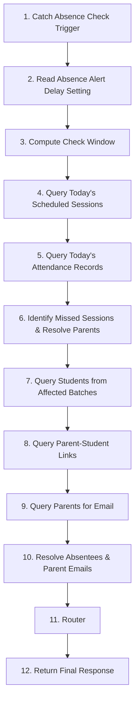

### 2. Step-by-Step Data Mapping & Node Configurations

#### Step 1: `Catch Absence Check Trigger`
- **Internal Name / ID**: `trigger`
- **Step Category / Type**: `TOOL_TRIGGER`
- **Integration Piece**: `@puchoaistudio/tool-webhook` (Action: `catch_webhook`)
- **Input Parameters & Configuration**:
```json
{
  "authType": "none",
  "authFields": {}
}
```

##### 📤 Output Data Payload Mapping:
Passes step output `{{trigger}}` down the pipeline for subsequent step consumption.

#### Step 2: `Read Absence Alert Delay Setting`
- **Internal Name / ID**: `step_1`
- **Step Category / Type**: `PIECE`
- **Integration Piece**: `@puchoaistudio/tool-google-sheets` (Action: `find_rows`)
- **Input Parameters & Configuration**:
```json
{
  "auth": "{{connections['ifn7Ir2FCcJFwy2JQjUtW']}}",
  "spreadsheetId": "1OTn3vT8qIeZFHzMZWAJHE_9ouqLGMiIF_zVEZQHq6DA",
  "sheetId": 0,
  "columnName": "key",
  "searchValue": "absence_alert_delay_hours",
  "matchCase": false,
  "startingRow": 1,
  "numberOfRows": 1,
  "includeTeamDrives": false
}
```

##### 📊 Data Source Configuration:
- **Google Spreadsheet ID**: `1OTn3vT8qIeZFHzMZWAJHE_9ouqLGMiIF_zVEZQHq6DA`

##### 📤 Output Data Payload Mapping:
Passes step output `{{step_1}}` down the pipeline for subsequent step consumption.

#### Step 3: `Compute Check Window`
- **Internal Name / ID**: `step_2`
- **Step Category / Type**: `CODE`
- **Input Parameters & Configuration**:
```json
{
  "payload": "{{trigger['body']}}",
  "settings_result": "{{step_1['data']}}"
}
```

##### 📤 Output Data Payload Mapping:
Passes step output `{{step_2}}` down the pipeline for subsequent step consumption.

#### Step 4: `Query Today's Scheduled Sessions`
- **Internal Name / ID**: `step_3`
- **Step Category / Type**: `PIECE`
- **Integration Piece**: `@puchoaistudio/tool-google-sheets` (Action: `find_rows`)
- **Input Parameters & Configuration**:
```json
{
  "auth": "{{connections['ifn7Ir2FCcJFwy2JQjUtW']}}",
  "spreadsheetId": "1OTn3vT8qIeZFHzMZWAJHE_9ouqLGMiIF_zVEZQHq6DA",
  "sheetId": 721558255,
  "columnName": "day",
  "searchValue": "{{step_2['day_name']}}",
  "matchCase": false,
  "startingRow": 1,
  "numberOfRows": 200,
  "includeTeamDrives": false
}
```

##### 📊 Data Source Configuration:
- **Google Spreadsheet ID**: `1OTn3vT8qIeZFHzMZWAJHE_9ouqLGMiIF_zVEZQHq6DA`
- **Sheet ID / Tab**: `721558255`

##### 📤 Output Data Payload Mapping:
Passes step output `{{step_3}}` down the pipeline for subsequent step consumption.

#### Step 5: `Query Today's Attendance Records`
- **Internal Name / ID**: `step_4`
- **Step Category / Type**: `PIECE`
- **Integration Piece**: `@puchoaistudio/tool-google-sheets` (Action: `find_rows`)
- **Input Parameters & Configuration**:
```json
{
  "auth": "{{connections['ifn7Ir2FCcJFwy2JQjUtW']}}",
  "spreadsheetId": "1OTn3vT8qIeZFHzMZWAJHE_9ouqLGMiIF_zVEZQHq6DA",
  "sheetId": 772014212,
  "columnName": "date",
  "searchValue": "{{step_2['check_date']}}",
  "matchCase": false,
  "startingRow": 1,
  "numberOfRows": 500,
  "includeTeamDrives": false
}
```

##### 📊 Data Source Configuration:
- **Google Spreadsheet ID**: `1OTn3vT8qIeZFHzMZWAJHE_9ouqLGMiIF_zVEZQHq6DA`
- **Sheet ID / Tab**: `772014212`

##### 📤 Output Data Payload Mapping:
Passes step output `{{step_4}}` down the pipeline for subsequent step consumption.

#### Step 6: `Identify Missed Sessions & Resolve Parents`
- **Internal Name / ID**: `step_5`
- **Step Category / Type**: `CODE`
- **Input Parameters & Configuration**:
```json
{
  "window": "{{step_2}}",
  "schedule_json": "{{step_3['data']}}",
  "attendance_json": "{{step_4['data']}}"
}
```

##### 📤 Output Data Payload Mapping:
Passes step output `{{step_5}}` down the pipeline for subsequent step consumption.

#### Step 7: `Query Students from Affected Batches`
- **Internal Name / ID**: `step_6`
- **Step Category / Type**: `PIECE`
- **Integration Piece**: `@puchoaistudio/tool-google-sheets` (Action: `find_rows`)
- **Input Parameters & Configuration**:
```json
{
  "auth": "{{connections['ifn7Ir2FCcJFwy2JQjUtW']}}",
  "spreadsheetId": "1OTn3vT8qIeZFHzMZWAJHE_9ouqLGMiIF_zVEZQHq6DA",
  "sheetId": 74175770,
  "columnName": "status",
  "searchValue": "active",
  "matchCase": false,
  "startingRow": 1,
  "numberOfRows": 500,
  "includeTeamDrives": false
}
```

##### 📊 Data Source Configuration:
- **Google Spreadsheet ID**: `1OTn3vT8qIeZFHzMZWAJHE_9ouqLGMiIF_zVEZQHq6DA`
- **Sheet ID / Tab**: `605693083` (enrollments)

##### 📤 Output Data Payload Mapping:
Passes step output `{{step_6}}` down the pipeline for subsequent step consumption.

#### Step 8: `Query Parent-Student Links`
- **Internal Name / ID**: `step_7`
- **Step Category / Type**: `PIECE`
- **Integration Piece**: `@puchoaistudio/tool-google-sheets` (Action: `get_all_rows`)
- **Input Parameters & Configuration**:
```json
{
  "auth": "{{connections['ifn7Ir2FCcJFwy2JQjUtW']}}",
  "spreadsheetId": "1OTn3vT8qIeZFHzMZWAJHE_9ouqLGMiIF_zVEZQHq6DA",
  "sheetId": 605693083,
  "memKey": "row_number",
  "startRow": 1,
  "groupSize": 1,
  "includeTeamDrives": false
}
```

##### 📊 Data Source Configuration:
- **Google Spreadsheet ID**: `1OTn3vT8qIeZFHzMZWAJHE_9ouqLGMiIF_zVEZQHq6DA`
- **Sheet ID / Tab**: `605693083`
- **Primary Key / LookUp Key**: `row_number`

##### 📤 Output Data Payload Mapping:
Passes step output `{{step_7}}` down the pipeline for subsequent step consumption.

#### Step 9: `Query Parents for Email`
- **Internal Name / ID**: `step_8`
- **Step Category / Type**: `PIECE`
- **Integration Piece**: `@puchoaistudio/tool-google-sheets` (Action: `get_all_rows`)
- **Input Parameters & Configuration**:
```json
{
  "auth": "{{connections['ifn7Ir2FCcJFwy2JQjUtW']}}",
  "spreadsheetId": "1OTn3vT8qIeZFHzMZWAJHE_9ouqLGMiIF_zVEZQHq6DA",
  "sheetId": 1278619599,
  "memKey": "row_number",
  "startRow": 1,
  "groupSize": 1,
  "includeTeamDrives": false
}
```

##### 📊 Data Source Configuration:
- **Google Spreadsheet ID**: `1OTn3vT8qIeZFHzMZWAJHE_9ouqLGMiIF_zVEZQHq6DA`
- **Sheet ID / Tab**: `1278619599`
- **Primary Key / LookUp Key**: `row_number`

##### 📤 Output Data Payload Mapping:
Passes step output `{{step_8}}` down the pipeline for subsequent step consumption.

#### Step 10: `Resolve Absentees & Parent Emails`
- **Internal Name / ID**: `step_9`
- **Step Category / Type**: `CODE`
- **Input Parameters & Configuration**:
```json
{
  "sp_json": "{{step_7['data']}}",
  "missed_json": "{{step_5}}",
  "parents_json": "{{step_8['data']}}",
  "students_json": "{{step_6['data']}}",
  "attendance_json": "{{step_4['data']}}"
}
```

##### 📤 Output Data Payload Mapping:
Passes step output `{{step_9}}` down the pipeline for subsequent step consumption.

#### Step 11: `Router`
- **Internal Name / ID**: `step_15`
- **Step Category / Type**: `ROUTER`

##### 📤 Output Data Payload Mapping:
Passes step output `{{step_15}}` down the pipeline for subsequent step consumption.

#### Step 12: `Return Final Response`
- **Internal Name / ID**: `step_16`
- **Step Category / Type**: `PIECE`
- **Integration Piece**: `@puchoaistudio/tool-webhook` (Action: `return_response`)
- **Input Parameters & Configuration**:
```json
{
  "fields": {
    "body": {
      "success": true,
      "notifications_sent": "{{step_9['notification_count']}}",
      "delay_hours": "{{step_9['delay_hours']}}",
      "message": "Absence notifications sent to all parents"
    },
    "status": 200,
    "headers": {}
  },
  "respond": "stop",
  "responseType": "json"
}
```

##### 📤 Output Data Payload Mapping:
Passes step output `{{step_16}}` down the pipeline for subsequent step consumption.

---

## 12. WF-M Absence Alert Engine

- **File**: [`WF-M_absence_alert.json`](file:///d:/Ravi/Ravi/Tennis%20Academy%20Platform/workflows/WF-M_absence_alert.json)
- **Description**: Cron-driven workflow checking for scheduled sessions with no attendance marked after a configurable timeframe. Sends absence notification email to parent via Gmail. Distinct from WF-F (pre-session confirmation) — WF-M is reactive/post-session. Configurable via platform_settings.absence_alert_delay_hours (default: 2 hours).
- **Total Execution Steps**: 13

### 1. Workflow Architecture & Flow Diagram

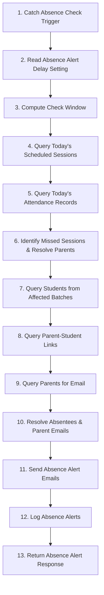

### 2. Step-by-Step Data Mapping & Node Configurations

#### Step 1: `Catch Absence Check Trigger`
- **Internal Name / ID**: `trigger`
- **Step Category / Type**: `TOOL_TRIGGER`
- **Integration Piece**: `@puchoaistudio/tool-webhook` (Action: `catch_webhook`)
- **Input Parameters & Configuration**:
```json
{
  "authType": "none",
  "authFields": {}
}
```

##### 📤 Output Data Payload Mapping:
Passes step output `{{trigger}}` down the pipeline for subsequent step consumption.

#### Step 2: `Read Absence Alert Delay Setting`
- **Internal Name / ID**: `step_1`
- **Step Category / Type**: `PIECE`
- **Integration Piece**: `@puchoaistudio/tool-google-sheets` (Action: `find_rows`)
- **Input Parameters & Configuration**:
```json
{
  "auth": "",
  "spreadsheetId": "1OTn3vT8qIeZFHzMZWAJHE_9ouqLGMiIF_zVEZQHq6DA",
  "sheetId": 0,
  "columnName": "key",
  "searchValue": "absence_alert_delay_hours",
  "matchCase": false,
  "startingRow": 1,
  "numberOfRows": 1,
  "includeTeamDrives": false
}
```

##### 📊 Data Source Configuration:
- **Google Spreadsheet ID**: `1OTn3vT8qIeZFHzMZWAJHE_9ouqLGMiIF_zVEZQHq6DA`

##### 📤 Output Data Payload Mapping:
Passes step output `{{step_1}}` down the pipeline for subsequent step consumption.

#### Step 3: `Compute Check Window`
- **Internal Name / ID**: `step_2`
- **Step Category / Type**: `CODE`
- **Input Parameters & Configuration**:
```json
{
  "settings_result": "{{step_1}}",
  "payload": "{{trigger['body']}}"
}
```

##### 📤 Output Data Payload Mapping:
Passes step output `{{step_2}}` down the pipeline for subsequent step consumption.

#### Step 4: `Query Today's Scheduled Sessions`
- **Internal Name / ID**: `step_3`
- **Step Category / Type**: `PIECE`
- **Integration Piece**: `@puchoaistudio/tool-google-sheets` (Action: `find_rows`)
- **Input Parameters & Configuration**:
```json
{
  "auth": "",
  "spreadsheetId": "1OTn3vT8qIeZFHzMZWAJHE_9ouqLGMiIF_zVEZQHq6DA",
  "sheetId": 721558255,
  "columnName": "day",
  "searchValue": "{{step_2['check_date']}}",
  "matchCase": false,
  "startingRow": 1,
  "numberOfRows": 200,
  "includeTeamDrives": false
}
```

##### 📊 Data Source Configuration:
- **Google Spreadsheet ID**: `1OTn3vT8qIeZFHzMZWAJHE_9ouqLGMiIF_zVEZQHq6DA`
- **Sheet ID / Tab**: `721558255`

##### 📤 Output Data Payload Mapping:
Passes step output `{{step_3}}` down the pipeline for subsequent step consumption.

#### Step 5: `Query Today's Attendance Records`
- **Internal Name / ID**: `step_4`
- **Step Category / Type**: `PIECE`
- **Integration Piece**: `@puchoaistudio/tool-google-sheets` (Action: `find_rows`)
- **Input Parameters & Configuration**:
```json
{
  "auth": "",
  "spreadsheetId": "1OTn3vT8qIeZFHzMZWAJHE_9ouqLGMiIF_zVEZQHq6DA",
  "sheetId": 772014212,
  "columnName": "date",
  "searchValue": "{{step_2['check_date']}}",
  "matchCase": false,
  "startingRow": 1,
  "numberOfRows": 500,
  "includeTeamDrives": false
}
```

##### 📊 Data Source Configuration:
- **Google Spreadsheet ID**: `1OTn3vT8qIeZFHzMZWAJHE_9ouqLGMiIF_zVEZQHq6DA`
- **Sheet ID / Tab**: `772014212`

##### 📤 Output Data Payload Mapping:
Passes step output `{{step_4}}` down the pipeline for subsequent step consumption.

#### Step 6: `Identify Missed Sessions & Resolve Parents`
- **Internal Name / ID**: `step_5`
- **Step Category / Type**: `CODE`
- **Input Parameters & Configuration**:
```json
{
  "schedule_json": "{{step_3}}",
  "attendance_json": "{{step_4}}",
  "window": "{{step_2}}"
}
```

##### 📤 Output Data Payload Mapping:
Passes step output `{{step_5}}` down the pipeline for subsequent step consumption.

#### Step 7: `Query Students from Affected Batches`
- **Internal Name / ID**: `step_6`
- **Step Category / Type**: `PIECE`
- **Integration Piece**: `@puchoaistudio/tool-google-sheets` (Action: `find_rows`)
- **Input Parameters & Configuration**:
```json
{
  "auth": "",
  "spreadsheetId": "1OTn3vT8qIeZFHzMZWAJHE_9ouqLGMiIF_zVEZQHq6DA",
  "sheetId": 74175770,
  "columnName": "status",
  "searchValue": "active",
  "matchCase": false,
  "startingRow": 1,
  "numberOfRows": 500,
  "includeTeamDrives": false
}
```

##### 📊 Data Source Configuration:
- **Google Spreadsheet ID**: `1OTn3vT8qIeZFHzMZWAJHE_9ouqLGMiIF_zVEZQHq6DA`
- **Sheet ID / Tab**: `605693083` (enrollments)

##### 📤 Output Data Payload Mapping:
Passes step output `{{step_6}}` down the pipeline for subsequent step consumption.

#### Step 8: `Query Parent-Student Links`
- **Internal Name / ID**: `step_7`
- **Step Category / Type**: `PIECE`
- **Integration Piece**: `@puchoaistudio/tool-google-sheets` (Action: `get_all_rows`)
- **Input Parameters & Configuration**:
```json
{
  "auth": "",
  "spreadsheetId": "1OTn3vT8qIeZFHzMZWAJHE_9ouqLGMiIF_zVEZQHq6DA",
  "sheetId": 605693083,
  "memKey": "row_number",
  "startRow": 1,
  "groupSize": 1,
  "includeTeamDrives": false
}
```

##### 📊 Data Source Configuration:
- **Google Spreadsheet ID**: `1OTn3vT8qIeZFHzMZWAJHE_9ouqLGMiIF_zVEZQHq6DA`
- **Sheet ID / Tab**: `605693083`
- **Primary Key / LookUp Key**: `row_number`

##### 📤 Output Data Payload Mapping:
Passes step output `{{step_7}}` down the pipeline for subsequent step consumption.

#### Step 9: `Query Parents for Email`
- **Internal Name / ID**: `step_8`
- **Step Category / Type**: `PIECE`
- **Integration Piece**: `@puchoaistudio/tool-google-sheets` (Action: `get_all_rows`)
- **Input Parameters & Configuration**:
```json
{
  "auth": "",
  "spreadsheetId": "1OTn3vT8qIeZFHzMZWAJHE_9ouqLGMiIF_zVEZQHq6DA",
  "sheetId": 1278619599,
  "memKey": "row_number",
  "startRow": 1,
  "groupSize": 1,
  "includeTeamDrives": false
}
```

##### 📊 Data Source Configuration:
- **Google Spreadsheet ID**: `1OTn3vT8qIeZFHzMZWAJHE_9ouqLGMiIF_zVEZQHq6DA`
- **Sheet ID / Tab**: `1278619599`
- **Primary Key / LookUp Key**: `row_number`

##### 📤 Output Data Payload Mapping:
Passes step output `{{step_8}}` down the pipeline for subsequent step consumption.

#### Step 10: `Resolve Absentees & Parent Emails`
- **Internal Name / ID**: `step_9`
- **Step Category / Type**: `CODE`
- **Input Parameters & Configuration**:
```json
{
  "missed_json": "{{step_5}}",
  "students_json": "{{step_6}}",
  "sp_json": "{{step_7}}",
  "parents_json": "{{step_8}}"
}
```

##### 📤 Output Data Payload Mapping:
Passes step output `{{step_9}}` down the pipeline for subsequent step consumption.

#### Step 11: `Send Absence Alert Emails`
- **Internal Name / ID**: `step_10`
- **Step Category / Type**: `PIECE`
- **Integration Piece**: `@puchoaistudio/tool-gmail` (Action: `send_email`)
- **Input Parameters & Configuration**:
```json
{
  "auth": "",
  "receiver": "{{ emails | join(',') }}",
  "subject": "{{step_9['notification_count']}} Student(s) Absent — Arnav Jain Tennis Academy",
  "body": "Dear Parents,\n\nOur system detected that the following student(s) may have missed their scheduled tennis session today ({{step_9['notifications'][0]['session_date']}}):\n\n\n  - {{n.student_name}} (scheduled at {{n.session_time}})\n\n\nIf this absence was not intended, please contact your coach or the academy administration.\n\n\nWe hope everything is okay with {{step_9['notifications'][0]['student_name']}}. Regular attendance is important for consistent progress. If your child was present and this notification was sent in error, please reach out and we'll update our records.\n\nWe hope everything is okay. Regular attendance is important for consistent progress. If any students were present and this notification was sent in error, please reach out and we'll update our records.\n\n\nThis is an automated alert from the Arnav Jain Tennis Academy platform.\nNotification sent {{step_9['delay_hours']}} hours after the scheduled session time.\n\n— Arnav Jain Tennis Academy",
  "body_type": "text",
  "cc": [
    "admin@arnavtennis.com"
  ],
  "bcc": [],
  "reply_to": [],
  "draft": false
}
```

##### 💬 Message & Notification Template:
- **Recipient**: `{{ emails | join(',') }}`
- **Subject**: `{{step_9['notification_count']}} Student(s) Absent — Arnav Jain Tennis Academy`
- **Content / Body**:
```text
Dear Parents,

Our system detected that the following student(s) may have missed their scheduled tennis session today ({{step_9['notifications'][0]['session_date']}}):


  - {{n.student_name}} (scheduled at {{n.session_time}})


If this absence was not intended, please contact your coach or the academy administration.


We hope everything is okay with {{step_9['notifications'][0]['student_name']}}. Regular attendance is important for consistent progress. If your child was present and this notification was sent in error, please reach out and we'll update our records.

We hope everything is okay. Regular attendance is important for consistent progress. If any students were present and this notification was sent in error, please reach out and we'll update our records.


This is an automated alert from the Arnav Jain Tennis Academy platform.
Notification sent {{step_9['delay_hours']}} hours after the scheduled session time.

— Arnav Jain Tennis Academy
```

##### 📤 Output Data Payload Mapping:
Passes step output `{{step_10}}` down the pipeline for subsequent step consumption.

#### Step 12: `Log Absence Alerts`
- **Internal Name / ID**: `step_11`
- **Step Category / Type**: `PIECE`
- **Integration Piece**: `@puchoaistudio/tool-google-sheets` (Action: `insert_row`)
- **Input Parameters & Configuration**:
```json
{
  "auth": "",
  "spreadsheetId": "1OTn3vT8qIeZFHzMZWAJHE_9ouqLGMiIF_zVEZQHq6DA",
  "sheetId": 0,
  "values": {
    "type": "absence_alert",
    "channel": "email",
    "status": "sent",
    "date": "{{step_9['notifications'][0]['session_date']}}"
  },
  "as_string": false,
  "first_row_headers": true,
  "includeTeamDrives": false
}
```

##### 📊 Data Source Configuration:
- **Google Spreadsheet ID**: `1OTn3vT8qIeZFHzMZWAJHE_9ouqLGMiIF_zVEZQHq6DA`

##### 📤 Output Data Payload Mapping:
Passes step output `{{step_11}}` down the pipeline for subsequent step consumption.

#### Step 13: `Return Absence Alert Response`
- **Internal Name / ID**: `step_12`
- **Step Category / Type**: `PIECE`
- **Integration Piece**: `@puchoaistudio/tool-webhook` (Action: `return_response`)
- **Input Parameters & Configuration**:
```json
{
  "fields": {
    "body": {
      "success": true,
      "notifications_sent": "{{step_9['notification_count']}}",
      "delay_hours": "{{step_9['delay_hours']}}",
      "message": "Absence alert notifications sent to parents"
    },
    "status": 200,
    "headers": {}
  },
  "respond": "stop",
  "responseType": "json"
}
```

##### 📤 Output Data Payload Mapping:
Passes step output `{{step_12}}` down the pipeline for subsequent step consumption.

---

## 13. WF-O Payment Reminder Email

- **File**: [`WF-O_payment_reminder_email.json`](file:///d:/Ravi/Ravi/Tennis%20Academy%20Platform/workflows/WF-O_payment_reminder_email.json)
- **Description**: Queries Supabase for packages with pending balance > 0, resolves the most overdue parent email, composes a professional personalized email body via LLM-AI, and sends via Gmail. Logs in communications_log. Runs one parent per invocation — the scheduler calls it repeatedly until all pending parents are notified.
- **Total Execution Steps**: 12

### 1. Workflow Architecture & Flow Diagram

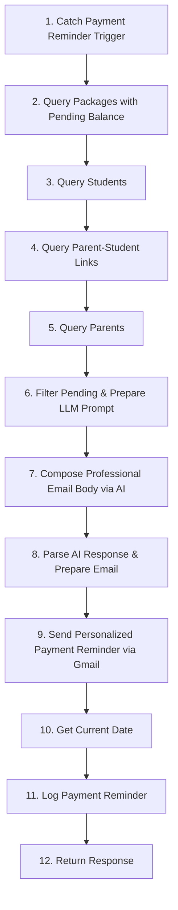

### 2. Step-by-Step Data Mapping & Node Configurations

#### Step 1: `Catch Payment Reminder Trigger`
- **Internal Name / ID**: `trigger`
- **Step Category / Type**: `TOOL_TRIGGER`
- **Integration Piece**: `@puchoaistudio/tool-webhook` (Action: `catch_webhook`)
- **Input Parameters & Configuration**:
```json
{
  "authType": "none",
  "authFields": {}
}
```

##### 📤 Output Data Payload Mapping:
Passes step output `{{trigger}}` down the pipeline for subsequent step consumption.

#### Step 2: `Query Packages with Pending Balance`
- **Internal Name / ID**: `step_1`
- **Step Category / Type**: `PIECE`
- **Integration Piece**: `@puchoaistudio/tool-google-sheets` (Action: `find_rows`)
- **Input Parameters & Configuration**:
```json
{
  "auth": "",
  "spreadsheetId": "1OTn3vT8qIeZFHzMZWAJHE_9ouqLGMiIF_zVEZQHq6DA",
  "sheetId": 1260552768,
  "columnName": "payment_status",
  "searchValue": "paid",
  "matchCase": false,
  "startingRow": 1,
  "numberOfRows": 200,
  "includeTeamDrives": false
}
```

##### 📊 Data Source Configuration:
- **Google Spreadsheet ID**: `1OTn3vT8qIeZFHzMZWAJHE_9ouqLGMiIF_zVEZQHq6DA`
- **Sheet ID / Tab**: `1260552768`

##### 📤 Output Data Payload Mapping:
Passes step output `{{step_1}}` down the pipeline for subsequent step consumption.

#### Step 3: `Query Students`
- **Internal Name / ID**: `step_2`
- **Step Category / Type**: `PIECE`
- **Integration Piece**: `@puchoaistudio/tool-google-sheets` (Action: `find_rows`)
- **Input Parameters & Configuration**:
```json
{
  "auth": "",
  "spreadsheetId": "1OTn3vT8qIeZFHzMZWAJHE_9ouqLGMiIF_zVEZQHq6DA",
  "sheetId": 74175770,
  "columnName": "status",
  "searchValue": "active",
  "matchCase": false,
  "startingRow": 1,
  "numberOfRows": 500,
  "includeTeamDrives": false
}
```

##### 📊 Data Source Configuration:
- **Google Spreadsheet ID**: `1OTn3vT8qIeZFHzMZWAJHE_9ouqLGMiIF_zVEZQHq6DA`
- **Sheet ID / Tab**: `605693083` (enrollments)

##### 📤 Output Data Payload Mapping:
Passes step output `{{step_2}}` down the pipeline for subsequent step consumption.

#### Step 4: `Query Parent-Student Links`
- **Internal Name / ID**: `step_3`
- **Step Category / Type**: `PIECE`
- **Integration Piece**: `@puchoaistudio/tool-google-sheets` (Action: `get_all_rows`)
- **Input Parameters & Configuration**:
```json
{
  "auth": "",
  "spreadsheetId": "1OTn3vT8qIeZFHzMZWAJHE_9ouqLGMiIF_zVEZQHq6DA",
  "sheetId": 605693083,
  "memKey": "row_number",
  "startRow": 1,
  "groupSize": 1,
  "includeTeamDrives": false
}
```

##### 📊 Data Source Configuration:
- **Google Spreadsheet ID**: `1OTn3vT8qIeZFHzMZWAJHE_9ouqLGMiIF_zVEZQHq6DA`
- **Sheet ID / Tab**: `605693083`
- **Primary Key / LookUp Key**: `row_number`

##### 📤 Output Data Payload Mapping:
Passes step output `{{step_3}}` down the pipeline for subsequent step consumption.

#### Step 5: `Query Parents`
- **Internal Name / ID**: `step_4`
- **Step Category / Type**: `PIECE`
- **Integration Piece**: `@puchoaistudio/tool-google-sheets` (Action: `get_all_rows`)
- **Input Parameters & Configuration**:
```json
{
  "auth": "",
  "spreadsheetId": "1OTn3vT8qIeZFHzMZWAJHE_9ouqLGMiIF_zVEZQHq6DA",
  "sheetId": 1278619599,
  "memKey": "row_number",
  "startRow": 1,
  "groupSize": 1,
  "includeTeamDrives": false
}
```

##### 📊 Data Source Configuration:
- **Google Spreadsheet ID**: `1OTn3vT8qIeZFHzMZWAJHE_9ouqLGMiIF_zVEZQHq6DA`
- **Sheet ID / Tab**: `1278619599`
- **Primary Key / LookUp Key**: `row_number`

##### 📤 Output Data Payload Mapping:
Passes step output `{{step_4}}` down the pipeline for subsequent step consumption.

#### Step 6: `Filter Pending & Prepare LLM Prompt`
- **Internal Name / ID**: `step_5`
- **Step Category / Type**: `CODE`
- **Input Parameters & Configuration**:
```json
{
  "packages_json": "{{step_1}}",
  "students_json": "{{step_2}}",
  "sp_json": "{{step_3}}",
  "parents_json": "{{step_4}}"
}
```

##### 📤 Output Data Payload Mapping:
Passes step output `{{step_5}}` down the pipeline for subsequent step consumption.

#### Step 7: `Compose Professional Email Body via AI`
- **Internal Name / ID**: `step_6`
- **Step Category / Type**: `PIECE`
- **Integration Piece**: `@puchoaistudio/tool-llm-ai` (Action: `askLlm`)
- **Input Parameters & Configuration**:
```json
{
  "auth": "",
  "model": "gpt-4o-mini",
  "query": "{{step_5['llmPrompt']}}",
  "temperature": "0.7",
  "maxTokens": "1000"
}
```

##### 📤 Output Data Payload Mapping:
Passes step output `{{step_6}}` down the pipeline for subsequent step consumption.

#### Step 8: `Parse AI Response & Prepare Email`
- **Internal Name / ID**: `step_7`
- **Step Category / Type**: `CODE`
- **Input Parameters & Configuration**:
```json
{
  "step5": "{{step_5}}",
  "llmOutput": "{{step_6['data']['response']}}"
}
```

##### 📤 Output Data Payload Mapping:
Passes step output `{{step_7}}` down the pipeline for subsequent step consumption.

#### Step 9: `Send Personalized Payment Reminder via Gmail`
- **Internal Name / ID**: `step_8`
- **Step Category / Type**: `PIECE`
- **Integration Piece**: `@puchoaistudio/tool-gmail` (Action: `send_email`)
- **Input Parameters & Configuration**:
```json
{
  "auth": "",
  "to": "{{step_7['parentEmail']}}",
  "subject": "{{step_7['subject']}}",
  "body": "{{step_7['body']}}",
  "body_type": "text",
  "cc": [],
  "bcc": [],
  "reply_to": [],
  "sender_name": "Tennis Academy Management",
  "draft": false
}
```

##### 💬 Message & Notification Template:
- **Recipient**: `{{step_7['parentEmail']}}`
- **Subject**: `{{step_7['subject']}}`
- **Content / Body**:
```text
{{step_7['body']}}
```

##### 📤 Output Data Payload Mapping:
Passes step output `{{step_8}}` down the pipeline for subsequent step consumption.

#### Step 10: `Get Current Date`
- **Internal Name / ID**: `step_date_9`
- **Step Category / Type**: `PIECE`
- **Integration Piece**: `@puchoaistudio/tool-date-helper` (Action: `get_current_date`)
- **Input Parameters & Configuration**:
```json
{
  "timeZone": "Asia/Kolkata",
  "timeFormat": "YYYY-MM-DD HH:mm:ss"
}
```

##### 📤 Output Data Payload Mapping:
Passes step output `{{step_date_9}}` down the pipeline for subsequent step consumption.

#### Step 11: `Log Payment Reminder`
- **Internal Name / ID**: `step_9`
- **Step Category / Type**: `PIECE`
- **Integration Piece**: `@puchoaistudio/tool-google-sheets` (Action: `insert_row`)
- **Input Parameters & Configuration**:
```json
{
  "auth": "",
  "spreadsheetId": "1OTn3vT8qIeZFHzMZWAJHE_9ouqLGMiIF_zVEZQHq6DA",
  "sheetId": 0,
  "values": {
    "type": "payment_reminder",
    "channel": "email",
    "status": "sent",
    "date": "{{step_date_9['result']}}"
  },
  "as_string": false,
  "first_row_headers": true,
  "includeTeamDrives": false
}
```

##### 📊 Data Source Configuration:
- **Google Spreadsheet ID**: `1OTn3vT8qIeZFHzMZWAJHE_9ouqLGMiIF_zVEZQHq6DA`

##### 📤 Output Data Payload Mapping:
Passes step output `{{step_9}}` down the pipeline for subsequent step consumption.

#### Step 12: `Return Response`
- **Internal Name / ID**: `step_10`
- **Step Category / Type**: `PIECE`
- **Integration Piece**: `@puchoaistudio/tool-webhook` (Action: `return_response`)
- **Input Parameters & Configuration**:
```json
{
  "fields": {
    "body": {
      "success": true,
      "sentTo": "{{step_7['parentEmail']}}",
      "studentName": "{{step_7['studentName']}}",
      "remainingPending": "{{step_7['totalPending']}}",
      "message": "Payment reminder sent to one parent. Call again to process the next pending parent."
    },
    "status": 200,
    "headers": {}
  },
  "respond": "stop",
  "responseType": "json"
}
```

##### 📤 Output Data Payload Mapping:
Passes step output `{{step_10}}` down the pipeline for subsequent step consumption.

---

## 14. WF-P Slot Report Email

- **File**: [`WF-P_slot_report_email.json`](file:///d:/Ravi/Ravi/Tennis%20Academy%20Platform/workflows/WF-P_slot_report_email.json)
- **Description**: Queries Supabase for batches, enrollments, and attendance data to generate Slot Analysis report. Gated behind verification check — queries report_verifications table. Sends formatted report via Gmail with CSV content. Returns 403 if not verified.
- **Total Execution Steps**: 3

### 1. Workflow Architecture & Flow Diagram

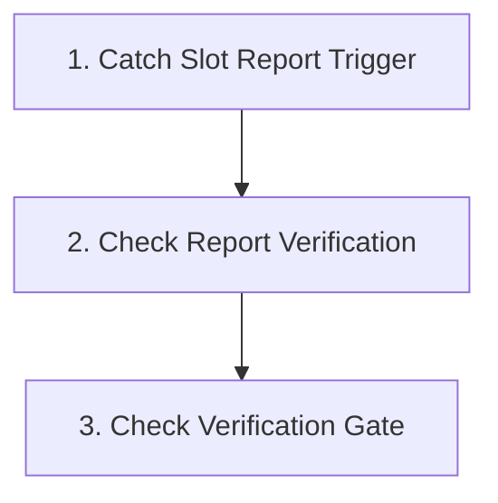

### 2. Step-by-Step Data Mapping & Node Configurations

#### Step 1: `Catch Slot Report Trigger`
- **Internal Name / ID**: `trigger`
- **Step Category / Type**: `TOOL_TRIGGER`
- **Integration Piece**: `@puchoaistudio/tool-webhook` (Action: `catch_webhook`)
- **Input Parameters & Configuration**:
```json
{
  "authType": "none",
  "authFields": {}
}
```

##### 📤 Output Data Payload Mapping:
Passes step output `{{trigger}}` down the pipeline for subsequent step consumption.

#### Step 2: `Check Report Verification`
- **Internal Name / ID**: `step_1`
- **Step Category / Type**: `PIECE`
- **Integration Piece**: `@puchoaistudio/tool-google-sheets` (Action: `find_rows`)
- **Input Parameters & Configuration**:
```json
{
  "auth": "",
  "spreadsheetId": "1OTn3vT8qIeZFHzMZWAJHE_9ouqLGMiIF_zVEZQHq6DA",
  "sheetId": 1052898027,
  "columnName": "month",
  "searchValue": "{{trigger['body']['month']}}",
  "matchCase": false,
  "startingRow": 1,
  "numberOfRows": 500,
  "includeTeamDrives": false
}
```

##### 📊 Data Source Configuration:
- **Google Spreadsheet ID**: `1OTn3vT8qIeZFHzMZWAJHE_9ouqLGMiIF_zVEZQHq6DA`
- **Sheet ID / Tab**: `1052898027`

##### 📤 Output Data Payload Mapping:
Passes step output `{{step_1}}` down the pipeline for subsequent step consumption.

#### Step 3: `Check Verification Gate`
- **Internal Name / ID**: `step_2`
- **Step Category / Type**: `ROUTER`

##### 📤 Output Data Payload Mapping:
Passes step output `{{step_2}}` down the pipeline for subsequent step consumption.

---

## 15. WF-Webhook-Store Data Persistence

- **File**: [`WF-webhook-store.json`](file:///d:/Ravi/Ravi/Tennis%20Academy%20Platform/workflows/WF-webhook-store.json)
- **Description**: Generic key/value data storage via webhook. Use Pucho AI Studio's built-in store tool to persist and retrieve arbitrary JSON data. POST with action:'put' + key + value to store, action:'get' + key to retrieve. Scope: Flow-level persistence (data survives between webhook invocations within the same flow).
- **Total Execution Steps**: 3

### 1. Workflow Architecture & Flow Diagram

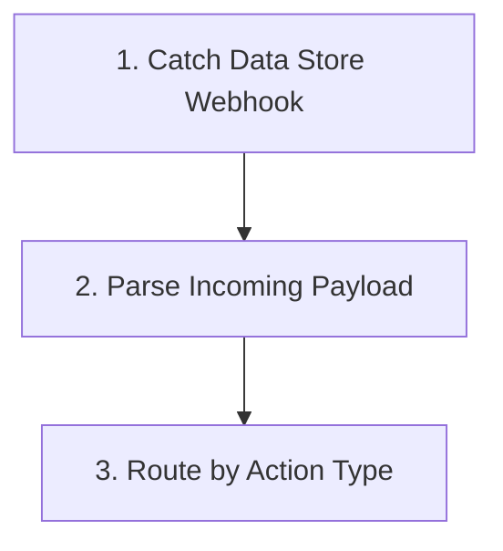

### 2. Step-by-Step Data Mapping & Node Configurations

#### Step 1: `Catch Data Store Webhook`
- **Internal Name / ID**: `trigger`
- **Step Category / Type**: `TOOL_TRIGGER`
- **Integration Piece**: `@puchoaistudio/tool-webhook` (Action: `catch_webhook`)
- **Input Parameters & Configuration**:
```json
{
  "authType": "none",
  "authFields": {}
}
```

##### 📤 Output Data Payload Mapping:
Passes step output `{{trigger}}` down the pipeline for subsequent step consumption.

#### Step 2: `Parse Incoming Payload`
- **Internal Name / ID**: `step_1`
- **Step Category / Type**: `CODE`
- **Input Parameters & Configuration**:
```json
{
  "payload": "{{trigger['body']}}"
}
```

##### 📤 Output Data Payload Mapping:
Passes step output `{{step_1}}` down the pipeline for subsequent step consumption.

#### Step 3: `Route by Action Type`
- **Internal Name / ID**: `step_2`
- **Step Category / Type**: `ROUTER`

##### 📤 Output Data Payload Mapping:
Passes step output `{{step_2}}` down the pipeline for subsequent step consumption.

---

